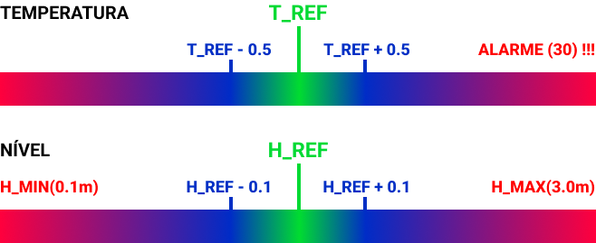

# Trabalho 01

> 📽️ [Vídeo de explicação e execução](https://youtu.be/FqttpVWbCY0)

## 🐧 Execução em Linux/WSL 
**1° passo:**
- Executar o simulador do aquecedor com o arquivo `Makefile` usando o comando `make runAquecedor`.
> Obs.: Lembre-se de estar no diretório do arquivo Makefile na pasta `Aquecedor` : `~/str-trabalho01/Aquecedor`.

**2° passo:**
- Executar o controlador com o arquivo `Makefile` usando o comando `make run`.
> Obs.: Lembre-se de estar no diretório do arquivo Makefile na pasta `Controle` : `~/str-trabalho01/Controle`.

**3° passo:**
- Simular o aquecedor clicando no botão `Simular` na janela aberta no passo 1.

----

## ⚙️ Execução cross -> Windows e Linux/WSL
**1° passo *(no terminal Windows PowerShell)*:**
- Executar o simulador do aquecedor `Aquecedor2021.jar` com duplo clique (terá porta padrão 4545).
- Ou executar com o script `java -jar .\Aquecedor2021.jar XXXX`, onde `XXXX` é a porta em que se deseja executar.
> Obs.: Lembre-se de estar no diretório do arquivo.

**2° passo *(no terminal Linux WSL)*:**
- Gerar o código objeto do controlador com o script `gcc -o main main.c sensores.c socket.c tela.c -lrt -lpthread`.

**3° passo *(no terminal Linux WSL)*:**
- Executar o código objeto do controlador com o script `./main xxx.yy.zz XXXX`, onde `xxx.yy.zz` é o IP local do WSL* e `XXXX` é o IP a porta em que está executando o simulador (se for a padrão é 4545).

> *Para encontrar o IP do WSL basta digitar no terminal do Windows (PowerShell) `ipconfig` e usar o Endereço IPv4.*

---

## Lógica de controle

  

----
## 🔗 Branches

- `main` 
  Branch principal onde contém o código de controle e criação do arquivo `dados_sensores.txt` com os tempos de resposta do controle de temperatura.
- `feature`
  - `controle-nivel-temp-coments` 
    Ramo da branch principal onde contém comentários auxiliares para a apresentação dos casos em tempo real, com apresentação em tela dos valores baixos, médios e altos da temperatura e nível.
  - `guarda-nivel` 
    Ramo da branch principal onde contém a geração do arquivo `dados_nivel.txt` com os tempos de resposta do controle de nível para o auxílio na criação de gráficos para a análise do mesmo.
